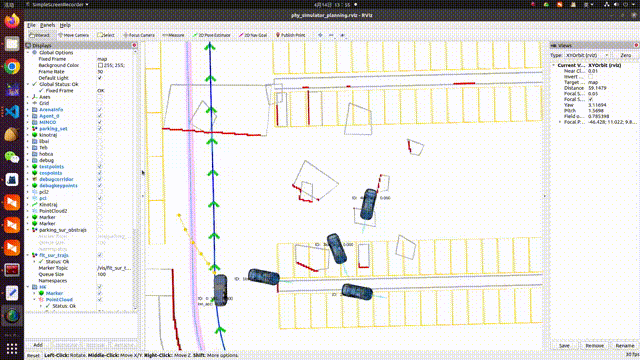

# Dftpav

A lightweight **Spatial-Temporal** trajectory planner for car-like robots。

## 0. Overview
**Related Paper**: 

Please cite the paper below if this repo helps you.

- [An Efficient Spatial-Temporal Trajectory Planner for Autonomous Vehicles in Unstructured Environments](https://arxiv.org/abs/2208.13160), Zhichao Han, Yuwei Wu, Tong Li, Lu Zhang, Liuao Pei, Long Xu, Chengyang Li, Changjia Ma, Chao Xu, Shaojie Shen, Fei Gao.
<div align=center>


</div>
## 1. Setup
All the tests are conducted in the Linux environment on a computer equipped with an Intel Core i7-10700 CPU and a GeForce RTX 2060 GPU.

Moreover, Our software is developed and tested in Ubuntu 18.04, 20.04 with ROS installed.

ROS can be installed here: [ROS Installation](http://wiki.ros.org/ROS/Installation).

## 2. Build on ROS

1. Install the dependence.

   ```
   sudo apt-get install libgoogle-glog-dev libdw-dev libopenblas-dev gfortran
   ```
   
   We use [Protocol Buffers](https://developers.google.com/protocol-buffers/) for parameter configuration. For the installation guide, please refer to this [link](https://github.com/protocolbuffers/protobuf/blob/master/src/README.md).

2. Create an empty new workspace and clone this repository to your workspace: 

   ```
   cd ~/your_catkin_ws/src
   git clone https://github.com/ZJU-FAST-Lab/Dftpav
   cd ..
   ```

3. Compile it.

   ```
   catkin_make -DCMAKE_BUILD_TYPE=Release
   ```

## 3. Run

Open a new terminal window, `cd ` to `~/your_catkin_ws/` and type:

```
source devel/setup.bash
```

Then, run the script:

```
./run.sh 
```

Then, you can use the **2D Nav Goal** in **RVIZ** to trigger the planning.

Here is an example:



## 4. Licence
The source code is released under [GPLv3](http://www.gnu.org/licenses/) license.

## 5. Maintaince

For any technical issue, please contact Zhichao HAN (zhichaohan@zju.edu.cn).

For commercial inquiries, please contact [Fei GAO](https://ustfei.com/) (fgaoaa@zju.edu.cn).
